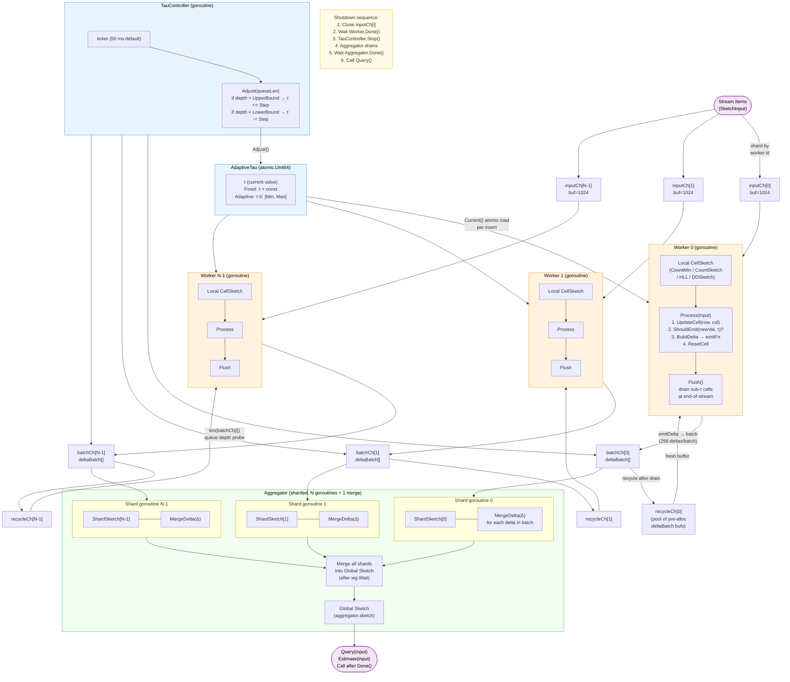

# OctoSketch Architecture



## Component Summary

| Component | Role | Goroutine? |
|---|---|---|
| **Worker** | Per-core stream processor; maintains local `CellSketch`; emits `DeltaUpdate` batches when cell value ≥ τ; flushes residuals at end-of-stream | Yes — one per worker |
| **CellSketch** | Pluggable sketch data structure (`UpdateCell`, `ShouldEmit`, `BuildDelta`, `ResetCell`, `MergeDelta`, `Estimate`, `Flush`) | No |
| **AdaptiveTau** | Shared atomic `float64` threshold τ; workers read it on every insert via `Current()` | No (lock-free) |
| **TauController** | Background ticker; probes aggregate `batchCh` queue depth; calls `AdaptiveTau.Adjust()` to apply backpressure or reduce latency | Yes — one |
| **batchCh / recycleCh** | Per-worker bounded channel pair; workers accumulate up to 256 deltas per `deltaBatch` before sending; aggregator shard recycles the buffer | — |
| **Aggregator shard goroutine** | One per worker; drains that worker's `batchCh`, calls `ShardSketch.MergeDelta()` for each delta, returns buffer to `recycleCh` | Yes — one per worker |
| **Global Sketch** | Final merged result; all shard sketches are merged into it via `Merge()` after all shard goroutines finish | No |
| **Query** | `Aggregator.Query(input)` → `GlobalSketch.Estimate(input)`; valid only after `Aggregator.Done()` | No |

## Data Flow (per stream item)

```
SketchInput
  └─► inputCh[w]
        └─► Worker.Process(input)
              ├─ UpdateCell(row, col)        # sketch-specific increment
              ├─ ShouldEmit(newVal, τ)?
              │     yes → BuildDelta(row,col) → batchBuf
              │              └─► [batch full] → batchCh[w]
              │                                    └─► ShardSketch[w].MergeDelta(Δ)
              └─ ResetCell(row, col)         # zero local cell after emission
```

## τ Adaptation Rule

```
Every 50 ms (TauController tick):
  queueLen = Σ len(batchCh[i])

  if queueLen > UpperBound (60% of buffer):   τ = min(τ + Step, Max)  ← slow down emission
  if queueLen < LowerBound (10% of buffer):   τ = max(τ - Step, Min)  ← speed up emission
  else:                                        τ unchanged
```

## Supported Sketch Types

| Sketch | `ShouldEmit` rule | `MergeDelta` rule | `ResetCell` |
|---|---|---|---|
| **CountMinSketch** | `val >= τ` | addition | `cell = 0` |
| **CountSketch** | `|val| >= τ` | addition | `cell = 0` |
| **HyperLogLog** | always true (on register increase) | max | no-op |
| **DDSketch** | `val >= τ` | addition | `cell = 0` |
